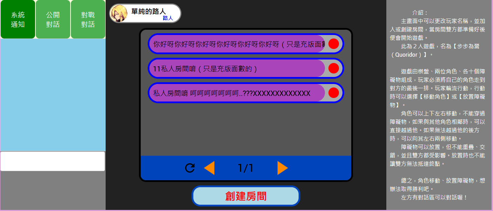

# js-node_OnlineGames
使用node.js架構的連線遊戲，並搭配ngrok將其部屬至線上

## 1.使用方法
- 1.將檔案 [連線遊戲colob.ipynb] 下載，並使用 colob 運行(也可以用電腦執行，不過可能需要有安裝 python/node.js 等)
- 2.前往 ngork 官網獲取金鑰
- 3.將金鑰放到 ipynb程式 的對應位置

- 4.執行後會有公用網址將伺服器架起，等待下方訊息 [已開啟服務器端口] 即可進入

- 5.進入網址後點擊 [Visit Site] 即可進入連線網站

- 6.最後就可以進行遊戲了

## 2.製作說明
本程式採用 html/javaScript 製作，並用 node.js 套件的 socket.io 進行連線操作

主要就是寫伺服器的 sever.js ，並使用 node 去開啟，最後連結到的對應 html 再寫相應的程式碼來呼叫/接收 soket 的事件

另外，出於興趣，所以把所有 CSS 的屬性全部都以 js 的方式進行編寫